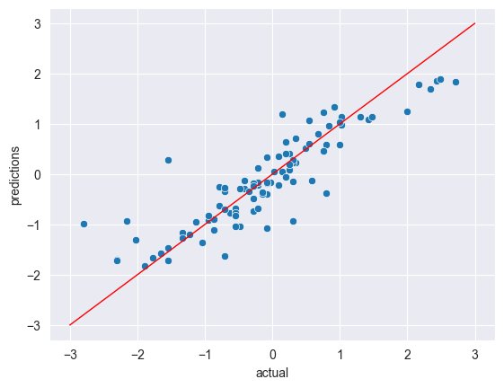
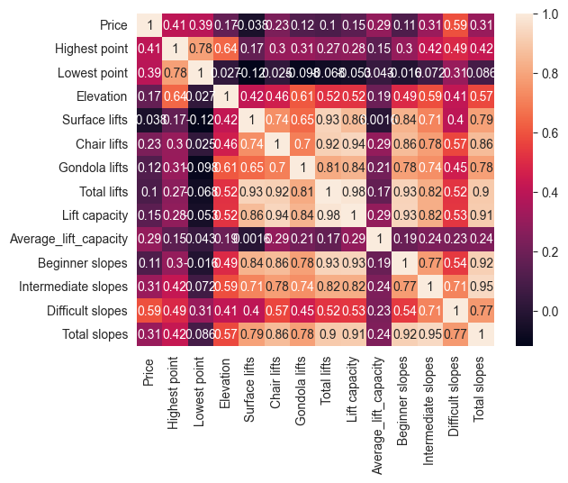
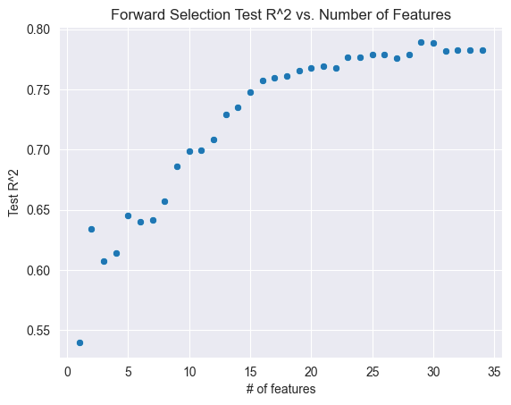

# Predicting Ski Resort Lift Ticket Prices


A machine learning analysis that predicts the price of a single-day ski resort lift ticket from geographical features and resort attributes, comparing eight regression models across three model families.

**Best model: Linear Regression with 29 features selected via forward stepwise selection — Test R² = 0.789.**

<p align="center">
  
</p>

---

## Project Overview

Ski resorts are a cornerstone of winter tourism, and lift ticket prices vary widely between resorts. This project builds and compares regression models that forecast ticket prices from resort characteristics — location, elevation, slopes, lift infrastructure, and amenities — providing a practical tool for market analysis for both consumers and resort operators.

The full analysis lives in a single annotated notebook:
[`notebooks/ski_resort_price_analysis.ipynb`](notebooks/ski_resort_price_analysis.ipynb)

## Dataset

The data comes from the ["Ski Resorts" dataset on Kaggle](https://www.kaggle.com/datasets/ulrikthygepedersen/ski-resorts/data), provided by Ulrik Thyge Pedersen. It covers **499 ski resorts worldwide** with **24 features** describing location, size, lift infrastructure, and amenities. The target variable is `Price` — the cost in Euros of a single-day lift ticket. A copy is included in this repository at [`data/resorts.csv`](data/resorts.csv).

## Methodology

### Data cleaning

- Removed 9 resorts with a listed price of 0, identified as missing entries.
- Investigated resorts with 0 beginner, intermediate, or difficult slopes — most are legitimately small, and notably Aspen Mountain correctly has 0 registered beginner slopes.
- Dropped the `Longest run` feature: 205 of its values were 0, determined to represent missing data rather than genuinely short runs.
- Removed one resort reporting 0 total lifts and 0 lift capacity.

### Feature engineering & preprocessing

- Derived two new features: `Elevation` (vertical drop, `Highest point − Lowest point`) and `Average_lift_capacity` (`Lift capacity / Total lifts`).
- Converted Yes/No amenity columns (`Child friendly`, `Snowparks`, `Nightskiing`, `Summer skiing`) to binary indicators.
- Normalized skewed numeric features with scikit-learn's `PowerTransformer`.
- One-hot encoded `Country` and `Continent`.

<p align="center">
  
</p>

### Modeling

The data was split 80/20 into training and test sets. Models were tuned with cross-validated grid search where applicable and compared on test-set R².

## Results

| Model | Test R² | Notes |
| --- | --- | --- |
| **Linear Regression (forward selection)** | **0.789** | **Best model — 29 features selected** |
| Linear Regression (Ridge, α = 0.92) | 0.768 | Best of the regularized linear models |
| Random Forest | 0.765 | Best tree-based model (max_leaf_nodes = 190, n_estimators = 260) |
| Linear Regression (full model) | 0.762 | Baseline with all features |
| Linear Regression (Lasso, α = 0.002) | 0.757 | Shrinks some coefficients to zero |
| K-Nearest Neighbors | 0.724 | Optimal at k = 5 |
| AdaBoost | 0.675 | learning_rate = 2.69, n_estimators = 650 |
| Decision Tree | 0.666 | max_depth = 6, max_leaf_nodes = 28 |

Forward stepwise selection found that a 29-feature linear model outperformed both the full model and every other approach tested:

<p align="center">
  
</p>

### Conclusion

A linear regression model using forward selection provides the most accurate predictions on this dataset. Residual analysis showed a slight tendency to overpredict cheaper resorts and underpredict more expensive ones — a potential direction for future improvement, along with incorporating the companion snowfall dataset that accompanies the resort data on Kaggle.

## Repository Structure

| Path | Purpose |
| --- | --- |
| `data/resorts.csv` | Source dataset (from Kaggle) |
| `notebooks/ski_resort_price_analysis.ipynb` | Full analysis: EDA, cleaning, modeling, evaluation |
| `reports/figures/` | Key figures exported from the analysis, including the fitted decision tree (`decision_tree.pdf`) |
| `requirements.txt` | Python dependencies |

## Getting Started

```bash
# 1. Clone the repository
git clone https://github.com/chernobylx/SkiMLProject.git
cd SkiMLProject

# 2. Install dependencies (Python 3 required)
pip install -r requirements.txt

# 3. Launch the notebook
jupyter notebook notebooks/ski_resort_price_analysis.ipynb
```

> **Note:** rendering the decision tree visualization additionally requires the [Graphviz system package](https://graphviz.org/download/) (`brew install graphviz` / `apt install graphviz`). All other cells run without it.

## Acknowledgements

- Dataset: [Ski Resorts](https://www.kaggle.com/datasets/ulrikthygepedersen/ski-resorts/data) by Ulrik Thyge Pedersen on Kaggle.
